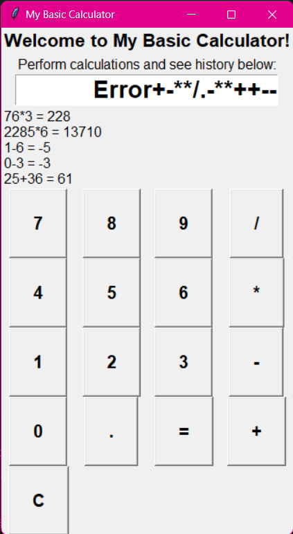

# Python Development Internship Repository

Welcome to my Python Development Internship repository. This repository serves as a submission for the projects completed during my internship. The internship was divided into two phases, each consisting of a normal task and a golden task.

## Table of Contents

- [Introduction](#introduction)
- [Phase 1](#phase-1)
  - [Normal Task - Calculator](#normal-task---calculator)
  - [Golden Task - Random Password Generator](#golden-task---random-password-generator)
- [Phase 2](#phase-2)
  - [Normal Task - Typing Speed Test](#normal-task---typing-speed-test)
  - [Golden Task - Voice Recorder](#golden-task---voice-recorder)
- [Final Thoughts](#final-thoughts)

## Introduction

This repository showcases the projects completed during my Python Development Internship. The internship was structured into two phases, each containing tasks to enhance my Python programming skills.

## Phase 1

### Normal Task - Calculator 👩‍🏫

For the normal task of the first phase, I designed a basic calculator using Python. The calculator provides standard arithmetic operations and was accompanied by a user-friendly graphical user interface (GUI) built using Tkinter.

**Run Command:**
```bash
python BasicCalculator.py
```


<div>
  
  
</div>

---

### Golden Task - Random Password Generator 🌟🔐

The golden task of the first phase led me to create a Random Password Generator. Developed in Python, this application features a user interface built with Streamlit. It offers the ability to generate strong and secure passwords based on various criteria, which are dynamically displayed within the application.

**Run Command:**
```bash
python PasswordGen.py
```


<div>
  
  
</div>

---

## Phase 2

### Normal Task - Typing Speed Test ⌨️🚀

In the second phase, I undertook the challenge of creating a Typing Speed Test. This task was designed as a game-like experience where users type a specific sentence. The application calculates the time taken and words per minute (WPM), displaying the result to the user. The user interface was crafted using Streamlit.

**Run Command:**
```bash
python TypingTest.py
```


<div>
  
  
  
</div>

---

### Golden Task - Voice Recorder 🎙️🔊

Among all the tasks, the golden task of developing a Voice Recorder posed the most significant challenge. I utilized Python to accomplish this, incorporating the Tkinter library to create the GUI. Finding the right libraries to efficiently record and capture audio proved to be quite a task, but the end result was rewarding.

**Run Command:**
```bash
python VoiceRecord.py
```


<div>
  
  
  
  
</div>

---

## Final Thoughts 💭✨

I am immensely grateful to Coders Cave for providing me with this invaluable opportunity. Working on these diverse and intriguing projects was an amazing experience. At times, it felt like I was rediscovering Python as I delved into these projects. They not only provided a quick refresher on various Python concepts but also allowed me to explore new territories.
